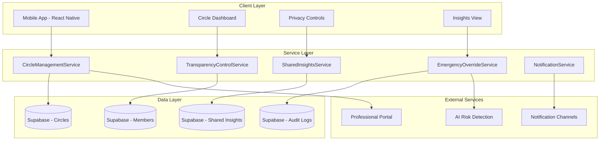
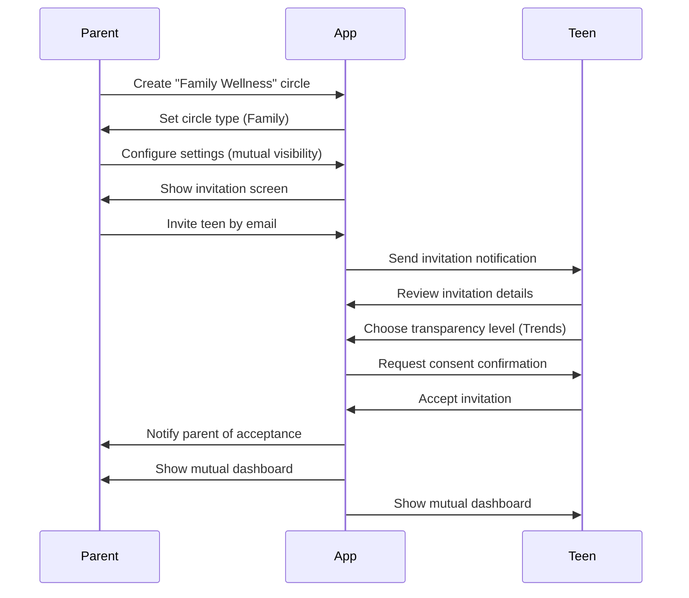

# SINAIS Circles - Complete System Architecture

## 🎯 Vision Statement

**SINAIS Circles** is a trust-based accountability ecosystem that enables mutual wellness monitoring without surveillance. Built on principles of consent, transparency, and ethical data sharing.

---

## 📋 Table of Contents

1. [Core Principles](#core-principles)
2. [System Architecture](#system-architecture)
3. [Database Schema](#database-schema)
4. [Service Layer](#service-layer)
5. [UI/UX Flow](#uiux-flow)
6. [Security & Privacy](#security--privacy)
7. [Legal Compliance](#legal-compliance)
8. [Implementation Roadmap](#implementation-roadmap)

---

## 🔑 Core Principles

### 1. **Consent First**
- All monitoring requires explicit acceptance
- Users control their transparency level
- Can revoke access anytime
- No forced participation

### 2. **Mutual Accountability**
- All circle members share data equally
- No one-way surveillance
- Transparency is bidirectional
- Everyone has the same visibility rights

### 3. **Privacy by Design**
- End-to-end encryption for shared data
- Audit trails for all access
- Data minimization (share only what's necessary)
- User owns and controls their data

### 4. **Age-Appropriate Controls**
- Minors (13-17) have special protections
- Parent-child circles have safeguards
- Auto-expiration at age 18
- Emergency override for critical risks only

---

## 🏗️ System Architecture



---

## 🗄️ Database Schema

### **1. accountability_circles**
Core table for circle management

```typescript
interface AccountabilityCircle {
  id: string;                    // UUID
  name: string;                  // "Family Wellness Circle"
  type: CircleType;              // 'duo' | 'family' | 'support' | 'challenge'
  created_by: string;            // User ID who created
  description?: string;          // Optional description
  settings: CircleSettings;      // JSONB - circle configuration
  created_at: Date;
  updated_at: Date;
  is_active: boolean;
}

type CircleType = 'duo' | 'family' | 'support' | 'challenge';

interface CircleSettings {
  allow_emergency_override: boolean;
  notification_frequency: 'realtime' | 'daily' | 'weekly';
  default_transparency: TransparencyLevel;
  require_mutual_acceptance: boolean;
}
```

### **2. circle_members**
Members in each circle with their permissions

```typescript
interface CircleMember {
  id: string;                           // UUID
  circle_id: string;                    // FK to accountability_circles
  user_id: string;                      // FK to user_profiles
  role: MemberRole;                     // 'member' | 'guardian' | 'professional'
  transparency_level: TransparencyLevel; // What this user shares
  can_view_level: TransparencyLevel;    // What this user can see from others
  joined_at: Date;
  invited_by: string;                   // User ID who invited
  acceptance_status: AcceptanceStatus;  // 'pending' | 'accepted' | 'rejected'
  auto_expire_at?: Date;                // For minors - expires at 18th birthday
  is_active: boolean;
  preferences: MemberPreferences;       // JSONB
}

type MemberRole = 'member' | 'guardian' | 'professional';
type TransparencyLevel = 'score_only' | 'trends' | 'detailed';
type AcceptanceStatus = 'pending' | 'accepted' | 'rejected' | 'revoked';

interface MemberPreferences {
  pause_sharing_until?: Date;           // Temporary pause
  quiet_hours: { start: string; end: string };
  notification_enabled: boolean;
  share_achievements: boolean;
  share_struggles: boolean;
}
```

### **3. shared_insights**
Aggregated wellness data shared within circles

```typescript
interface SharedInsight {
  id: string;
  circle_id: string;
  user_id: string;              // Whose data this is
  insight_type: InsightType;    // Type of insight
  data: InsightData;            // JSONB - the actual insight
  visibility_level: TransparencyLevel;
  created_at: Date;
  expires_at?: Date;            // Auto-delete after period
}

type InsightType = 
  | 'wellness_score' 
  | 'activity_summary' 
  | 'risk_alert' 
  | 'achievement' 
  | 'goal_progress'
  | 'pattern_detection';

interface InsightData {
  score?: number;               // 0-100 wellness score
  trend?: 'improving' | 'stable' | 'declining';
  summary?: string;             // Human-readable summary
  metrics?: Record<string, any>; // Detailed metrics
  ai_analysis?: string;         // AI-generated insights
}
```

### **4. access_audit_log**
Complete audit trail of who accessed what

```typescript
interface AccessAuditLog {
  id: string;
  circle_id: string;
  viewer_id: string;            // Who accessed the data
  subject_id: string;           // Whose data was accessed
  access_type: AccessType;
  data_accessed: string;        // What was viewed
  timestamp: Date;
  ip_address?: string;
  device_info?: string;
}

type AccessType = 
  | 'view_score' 
  | 'view_trends' 
  | 'view_details' 
  | 'emergency_override' 
  | 'export_data';
```

### **5. circle_invitations**
Invitation management

```typescript
interface CircleInvitation {
  id: string;
  circle_id: string;
  inviter_id: string;           // Who sent the invitation
  invitee_email: string;        // Who is being invited
  invitee_id?: string;          // If user exists
  role: MemberRole;
  message?: string;             // Personal message
  status: InvitationStatus;
  created_at: Date;
  expires_at: Date;             // Invitations expire after 7 days
  accepted_at?: Date;
  rejected_at?: Date;
}

type InvitationStatus = 'pending' | 'accepted' | 'rejected' | 'expired';
```

### **6. emergency_events**
Critical risk events and escalations

```typescript
interface EmergencyEvent {
  id: string;
  user_id: string;              // User in crisis
  circle_id?: string;           // Associated circle
  event_type: EmergencyType;
  severity: 'low' | 'medium' | 'high' | 'critical';
  detection_method: 'ai' | 'manual' | 'pattern';
  details: EmergencyDetails;    // JSONB
  notified_members: string[];   // Array of user IDs notified
  resolved: boolean;
  resolved_at?: Date;
  created_at: Date;
}

type EmergencyType = 
  | 'self_harm_risk' 
  | 'severe_addiction' 
  | 'financial_crisis' 
  | 'pattern_escalation'
  | 'mental_health_emergency';

interface EmergencyDetails {
  triggers: string[];           // What triggered the alert
  ai_confidence: number;        // AI detection confidence
  recommended_action: string;   // What to do
  professional_referral?: string; // Suggested professional help
}
```

---

## 🛠️ Service Layer

### **1. CircleManagementService**
Core service for circle CRUD operations

```typescript
// services/CircleManagementService.ts

export class CircleManagementService {
  
  // Create a new circle
  static async createCircle(
    userId: string,
    circleData: CreateCircleDTO
  ): Promise<AccountabilityCircle> {
    // 1. Validate user permissions
    // 2. Create circle in database
    // 3. Add creator as first member
    // 4. Send invitations if provided
    // 5. Log action to audit trail
    // 6. Return created circle
  }

  // Invite member to circle
  static async inviteMember(
    circleId: string,
    inviterId: string,
    inviteeEmail: string,
    role: MemberRole
  ): Promise<CircleInvitation> {
    // 1. Verify inviter is circle member
    // 2. Check if invitee already in circle
    // 3. Create invitation with 7-day expiry
    // 4. Send notification to invitee
    // 5. Return invitation
  }

  // Accept circle invitation
  static async acceptInvitation(
    invitationId: string,
    userId: string,
    transparencyLevel: TransparencyLevel
  ): Promise<CircleMember> {
    // 1. Validate invitation is active
    // 2. Check user age (if minor, apply restrictions)
    // 3. Add user to circle with chosen transparency
    // 4. Notify circle members
    // 5. Update invitation status
    // 6. Return membership
  }

  // Leave a circle
  static async leaveCircle(
    circleId: string,
    userId: string
  ): Promise<void> {
    // 1. Verify user is member
    // 2. Check if last member (delete circle if yes)
    // 3. Revoke all shared insights
    // 4. Notify remaining members
    // 5. Remove membership
  }

  // Get user's circles
  static async getUserCircles(
    userId: string
  ): Promise<AccountabilityCircle[]> {
    // Return all circles where user is a member
  }
}
```

### **2. TransparencyControlService**
Manage privacy and sharing preferences

```typescript
// services/TransparencyControlService.ts

export class TransparencyControlService {
  
  // Update transparency level
  static async updateTransparency(
    circleId: string,
    userId: string,
    level: TransparencyLevel
  ): Promise<void> {
    // 1. Validate user is circle member
    // 2. Check if level change is allowed (minors may have restrictions)
    // 3. Update transparency level
    // 4. Notify circle members of change
    // 5. Adjust shared insights visibility
  }

  // Pause sharing temporarily
  static async pauseSharing(
    circleId: string,
    userId: string,
    duration: number // hours
  ): Promise<void> {
    // 1. Verify user can pause (max 24h for minors)
    // 2. Set pause_sharing_until timestamp
    // 3. Hide current insights
    // 4. Notify circle members
  }

  // Resume sharing
  static async resumeSharing(
    circleId: string,
    userId: string
  ): Promise<void> {
    // 1. Clear pause_sharing_until
    // 2. Regenerate current insights
    // 3. Notify circle members
  }

  // Get transparency settings
  static async getTransparencySettings(
    circleId: string,
    userId: string
  ): Promise<MemberPreferences> {
    // Return user's current privacy settings
  }
}
```

### **3. SharedInsightsService**
Generate and manage shared wellness data

```typescript
// services/SharedInsightsService.ts

export class SharedInsightsService {
  
  // Generate wellness score
  static async generateWellnessScore(
    userId: string
  ): Promise<number> {
    // 1. Fetch user's recent activities
    // 2. Analyze betting patterns
    // 3. Check app usage data
    // 4. Calculate composite score (0-100)
    // 5. Return score
  }

  // Create shareable insight
  static async createSharedInsight(
    circleId: string,
    userId: string,
    insightType: InsightType
  ): Promise<SharedInsight> {
    // 1. Check user's transparency level
    // 2. Generate appropriate insight data
    // 3. Apply privacy filters
    // 4. Store in shared_insights table
    // 5. Notify circle members
    // 6. Return insight
  }

  // Get circle insights
  static async getCircleInsights(
    circleId: string,
    viewerId: string
  ): Promise<SharedInsight[]> {
    // 1. Verify viewer is circle member
    // 2. Fetch insights visible to viewer
    // 3. Filter by viewer's permission level
    // 4. Log access to audit trail
    // 5. Return insights
  }

  // Generate activity summary
  static async generateActivitySummary(
    userId: string,
    period: 'day' | 'week' | 'month'
  ): Promise<InsightData> {
    // 1. Aggregate user activities for period
    // 2. Identify patterns and trends
    // 3. Generate human-readable summary
    // 4. Return summary data
  }
}
```

### **4. EmergencyOverrideService**
Handle critical risk detection and alerts

```typescript
// services/EmergencyOverrideService.ts

export class EmergencyOverrideService {
  
  // Detect emergency patterns
  static async detectEmergency(
    userId: string,
    activityData: any
  ): Promise<EmergencyEvent | null> {
    // 1. Run AI risk assessment
    // 2. Check for critical patterns
    // 3. Calculate severity level
    // 4. If emergency detected, create event
    // 5. Trigger emergency protocol
    // 6. Return event or null
  }

  // Trigger emergency alert
  static async triggerEmergencyAlert(
    eventId: string
  ): Promise<void> {
    // 1. Fetch emergency event
    // 2. Get user's circles
    // 3. Override privacy settings temporarily
    // 4. Notify all circle members immediately
    // 5. Send professional referrals
    // 6. Log all actions to audit
  }

  // Resolve emergency
  static async resolveEmergency(
    eventId: string,
    resolvedBy: string,
    notes: string
  ): Promise<void> {
    // 1. Mark emergency as resolved
    // 2. Restore normal privacy settings
    // 3. Notify circle members
    // 4. Store resolution notes
  }

  // Get emergency history
  static async getEmergencyHistory(
    userId: string
  ): Promise<EmergencyEvent[]> {
    // Return user's emergency events (if authorized)
  }
}
```

---

## 🎨 UI/UX Flow

### **Screen Structure**

```
screens/
├── circles/
│   ├── CirclesListScreen.tsx          # View all circles
│   ├── CreateCircleScreen.tsx         # Create new circle
│   ├── CircleDetailScreen.tsx         # Circle dashboard
│   ├── InviteMembersScreen.tsx        # Invite to circle
│   ├── CircleInsightsScreen.tsx       # Shared insights view
│   └── TransparencySettingsScreen.tsx # Privacy controls
│
└── navigation updates in App.tsx
```

### **User Journey: Creating a Family Circle**



### **Dashboard Components**

#### **1. Circle Overview Card**
```typescript
<CircleOverviewCard>
  - Circle name and type
  - Number of members
  - Your transparency level
  - Quick actions (invite, settings, leave)
</CircleOverviewCard>
```

#### **2. Member Status Grid**
```typescript
<MemberStatusGrid>
  {members.map(member => (
    <MemberCard>
      - Name and avatar
      - Current wellness score (if visible)
      - Trend indicator (↑↓→)
      - Last active timestamp
      - View details button
    </MemberCard>
  ))}
</MemberStatusGrid>
```

#### **3. Insights Feed**
```typescript
<InsightsFeed>
  - Recent achievements
  - Pattern changes
  - Goal milestones
  - Support moments
  - Emergency alerts (if any)
</InsightsFeed>
```

---

## 🔐 Security & Privacy

### **Encryption Strategy**

1. **Data at Rest**
   - All shared insights encrypted with AES-256
   - User preferences encrypted in database
   - Audit logs stored with encryption

2. **Data in Transit**
   - TLS 1.3 for all API calls
   - End-to-end encryption for sensitive messages
   - Secure WebSocket for real-time updates

3. **Access Control**
   - Row-level security (RLS) in Supabase
   - JWT-based authentication
   - Role-based permissions (member/guardian/professional)

### **Privacy Safeguards**

1. **Data Minimization**
   ```typescript
   // Only share what's necessary based on transparency level
   function filterInsightByLevel(
     insight: InsightData,
     level: TransparencyLevel
   ): Partial<InsightData> {
     switch (level) {
       case 'score_only':
         return { score: insight.score };
       case 'trends':
         return { score: insight.score, trend: insight.trend, summary: insight.summary };
       case 'detailed':
         return insight; // Full data
     }
   }
   ```

2. **Audit Everything**
   ```typescript
   // Log every access to shared data
   await AuditService.logAccess({
     viewer_id: currentUser.id,
     subject_id: dataOwner.id,
     access_type: 'view_details',
     circle_id: circle.id,
     timestamp: new Date(),
   });
   ```

3. **User Control**
   - Revoke access anytime
   - Export all shared data
   - Delete circle and all traces
   - Pause sharing temporarily

---

## ⚖️ Legal Compliance

### **LGPD Compliance (Brazil)**

1. **Consent Management**
   ```typescript
   interface ConsentRecord {
     user_id: string;
     circle_id: string;
     consent_type: 'data_sharing' | 'emergency_override' | 'professional_access';
     granted_at: Date;
     revoked_at?: Date;
     consent_text: string;  // Exact text shown to user
   }
   ```

2. **Minor Protection (Ages 13-17)**
   - Requires parental consent for circle creation
   - Minor must also assent (dual consent)
   - Limited transparency options (no full detailed access without minor approval)
   - Auto-expiration at 18th birthday
   - Cannot be added to professional circles without explicit consent

3. **Data Rights**
   - Right to access all shared data
   - Right to rectification
   - Right to deletion (with circle impact notice)
   - Right to data portability (export)
   - Right to revoke consent

### **Terms of Service Key Points**

```markdown
## SINAIS Circles Terms

1. **Voluntary Participation**
   - All circle participation is voluntary
   - You can leave any circle at any time
   - Leaving a circle deletes all your shared insights

2. **Mutual Accountability**
   - All members share data based on their transparency level
   - No member has superior access rights
   - Emergency overrides apply equally to all members

3. **Minor Safety**
   - Minors require parental consent AND personal assent
   - Parents see wellness scores by default
   - Detailed data requires minor approval
   - Circle membership expires automatically at age 18

4. **Liability Limitations**
   - SINAIS Circles is a wellness tool, not medical advice
   - Emergency detection is AI-assisted but not infallible
   - Professional help should be sought for serious issues
   - App creators are not liable for circle member actions

5. **Data Handling**
   - Data shared within circles is encrypted
   - Access is logged and auditable
   - Data is deleted when you leave a circle
   - Export your data anytime
```

---

## 🗺️ Implementation Roadmap

### **Phase 1: Foundation (Weeks 1-2)**
- [x] Complete architecture design
- [ ] Create database schema in Supabase
- [ ] Set up Row Level Security policies
- [ ] Build CircleManagementService
- [ ] Create basic circle CRUD screens

### **Phase 2: Core Features (Weeks 3-4)**
- [ ] Implement TransparencyControlService
- [ ] Build SharedInsightsService
- [ ] Create wellness score algorithm
- [ ] Design and implement UI screens
- [ ] Add invitation flow

### **Phase 3: Safety Features (Weeks 5-6)**
- [ ] Build EmergencyOverrideService
- [ ] Implement AI risk detection
- [ ] Create emergency alert system
- [ ] Add professional integration
- [ ] Build audit logging

### **Phase 4: UX Polish (Weeks 7-8)**
- [ ] Design mutual dashboard
- [ ] Create insights feed
- [ ] Add real-time notifications
- [ ] Implement data export
- [ ] Build privacy controls UI

### **Phase 5: Testing & Launch (Weeks 9-10)**
- [ ] Focus group testing (parents + teens)
- [ ] Security audit
- [ ] Legal review
- [ ] Beta launch
- [ ] Gather feedback and iterate

---

## 📊 Success Metrics

### **Engagement Metrics**
- Number of active circles
- Average circle size
- Daily active circle members
- Transparency level distribution

### **Safety Metrics**
- Emergency events detected
- Emergency events resolved
- Professional referrals made
- Crisis intervention success rate

### **Trust Metrics**
- Circle retention rate (30, 60, 90 days)
- Privacy control usage
- Transparency level changes over time
- Parent-teen mutual circles vs one-way

### **Compliance Metrics**
- Consent acceptance rate
- Data access requests
- Privacy policy violations (should be 0)
- Audit log completeness

---

## 🚀 Next Steps

1. **Review this architecture** with your team
2. **Get legal review** on minor consent flows
3. **Create Supabase schema** from defined tables
4. **Build MVP** with basic circle creation + invitation
5. **Test with focus group** before full rollout

---

## 📚 Additional Resources

- [LGPD Compliance Guide](https://www.gov.br/cidadania/pt-br/acesso-a-informacao/lgpd)
- [React Native Best Practices](https://reactnative.dev/docs/security)
- [Supabase Row Level Security](https://supabase.com/docs/guides/auth/row-level-security)
- [AI Ethics Framework](https://www.microsoft.com/en-us/ai/responsible-ai)

---

**Document Version:** 1.0  
**Last Updated:** 2025-10-14  
**Status:** Ready for Implementation